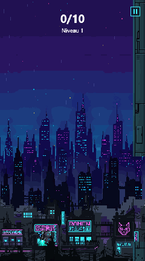
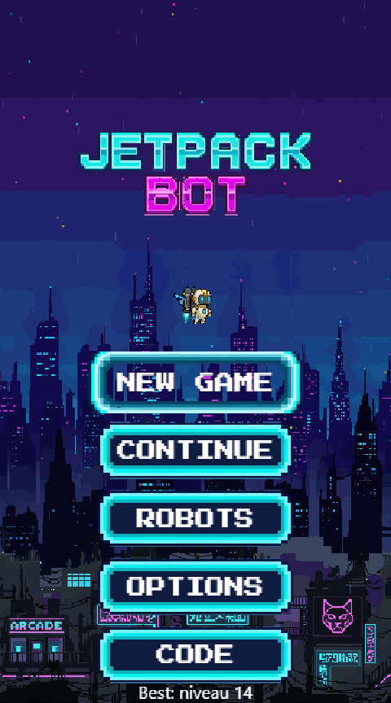
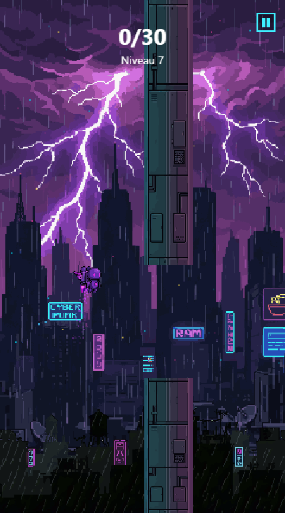
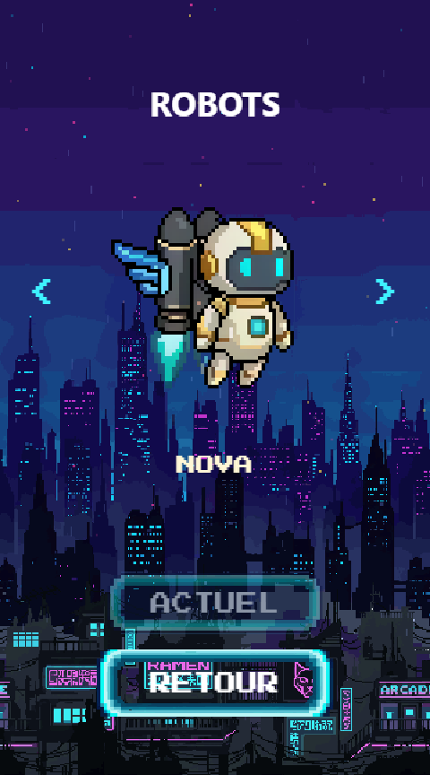
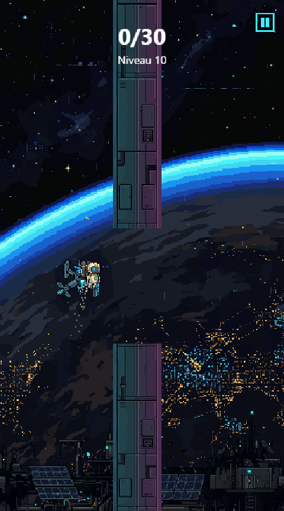

# Jetpack Bot

Flappy-like vertical : un **robot à jetpack** s'élève depuis une mégapole cyberpunk
jusqu'à l'orbite terrestre. Tape pour activer la poussée (le robot monte), relâche et
la gravité le fait redescendre. Slalome entre les tours néon, franchis les portes, et
gravis des niveaux infinis à travers 5 mondes.

<p align="center">
  
  
  
</p>

## Comment jouer

- **Une seule action** : tape l'écran (mobile), clic gauche, ou barre **Espace** (desktop) pour la poussée.
- Passe entre les piliers sans les toucher ni sortir de l'écran.
- **Franchis les portes** pour terminer un niveau : 10 au niveau 1, +5 par niveau (plafonné à 30).
- **Crash** → tu rejoues le niveau en cours (pas de retour au début).
- **Échap** ou ⏸ pour mettre en pause (reprendre, recommencer, options, menu).
- Menus au clavier (flèches + Entrée) ou à la souris/tap.

### Progression & sauvegarde

Le jeu distingue ta **partie en cours** (là où CONTINUE te ramène) de ton **record**
(meilleur niveau à vie — il ne régresse jamais et conditionne les robots débloqués).
NEW GAME repart au niveau 1 après confirmation ; tes robots restent acquis.

Tout est sauvegardé dans le navigateur, et l'écran **CODE** fournit une sauvegarde
**façon mot de passe rétro** : un code `JB1-XXX` (à copier, ou en lien direct
`…#save=JB1-XXX`) qui restaure ta progression sur n'importe quel appareil — aucun
compte, aucun backend.

### Les 5 mondes

Chaque tranche de niveaux a son décor, sa piste chiptune et son robot pilote à
débloquer dans le hangar **ROBOTS** :

| Niveaux | Monde          | Robot à débloquer      |
|--------:|----------------|------------------------|
| 1-2     | Nuit urbaine   | PROTO (cyan, de série) |
| 3-4     | Industriel     | FORGE (orange rouille) |
| 5-6     | Zone toxique   | VENIN (vert acide)     |
| 7-9     | Tempête néon   | ORAGE (violet)         |
| 10+     | Orbite         | NOVA (blanc doré)      |

<p align="center">
  
  
</p>

## Lancer le projet

Prérequis : Node 18+.

```bash
npm install
npm run dev        # serveur de dev (Vite) — http://localhost:5173
npm run build      # build statique déployable dans dist/
npm run preview    # prévisualise le build
npm test           # suite de tests (Vitest)
```

## Stack & architecture

100 % **vanilla JavaScript (ES modules) + Canvas 2D**, **zéro dépendance runtime**.
[Vite](https://vitejs.dev) pour le dev/build, [Vitest](https://vitest.dev) pour les
tests (300+). Modules purs à responsabilité unique ; le DOM n'est touché que par le
bootstrap et l'overlay de saisie de code.

```
src/
├── main.js              # bootstrap + boucle + restauration #save= au boot
├── config.js            # constantes (physique, niveaux, layouts, audio)
├── engine/
│   ├── loop.js          # game loop à pas de temps fixe
│   ├── state.js         # machine à états (Menu/Play/Pause/Confirm/Options/…)
│   ├── input.js         # tap/clic/espace + nav clavier + échap + réglages
│   ├── assets.js        # préchargement images
│   ├── audio.js         # canaux SFX + musique (volumes, boucles, autoplay)
│   └── font.js          # chargement de la police pixel (Press Start 2P)
├── game/
│   ├── world.js         # orchestration : run, niveaux, collisions, routage menus
│   ├── robot.js         # physique du robot
│   ├── obstacles.js     # spawn / défilement / recyclage
│   ├── level.js         # courbe de difficulté par niveau
│   ├── patterns.js      # salves d'obstacles (flow, escalier, zigzag, couloir, chicane)
│   ├── score.js         # partie en cours (level) vs record, persistance
│   ├── save.js          # codes JB1-XXX (base32 Crockford + checksum)
│   ├── savecode.js      # écran CODE (copier / lien / saisir)
│   ├── skins.js         # robots jouables, seuils de déblocage
│   ├── menu.js          # menus purs (hitTest / focus / activation)
│   ├── options.js       # réglages de volumes
│   ├── settings.js      # persistance des volumes
│   ├── music.js         # piste par état + décor
│   ├── collision.js     # AABB + limites
│   ├── background.js    # parallaxe
│   └── particles.js / ambiance.js / twinkle.js   # décor animé
├── render/
│   ├── renderer.js      # rendu Canvas (monde + HUD) + dispatch par état
│   ├── buttons.js       # plaque néon partagée + labels auto-ajustés
│   └── menu.js / pause.js / confirm.js / options.js / savecode.js / skins.js
└── ui/
    └── codeinput.js     # seul module DOM : overlay de saisie du code
```

### Difficulté par niveau

Contenu infini, aucun niveau dessiné à la main — tout est dérivé par formule
(voir `src/game/level.js`, `src/game/patterns.js` et `src/config.js`) :

- **Objectif** : `min(10 + 5·(niveau−1), 30)` portes.
- **Vitesse / ouverture / espacement** progressent (avec plafonds) ; les capacités
  physiques du robot évoluent aussi, de façon asymétrique et calibrée.
- **Patterns** : les obstacles arrivent en salves structurées (flow, escalier,
  zigzag, couloir, chicane) tirées d'un pool qui s'élargit par tier de monde.
- L'invariant de jouabilité (chaque salve reste passable avec les capacités du
  niveau) est vérifié par les tests.

## Audio

7 pistes chiptune **générées par script** (`scripts/music.mjs`, zéro dépendance,
rendu WAV reproductible) : une par monde + menu + jingle game over. SFX générés
via `scripts/sfx.mjs`. Volumes SFX/musique réglables en jeu (OPTIONS), persistés.

## Assets

Sprites et décors pixel-art générés via [PixelLab](https://pixellab.ai) (API v2) à
l'aide de `scripts/pixellab.mjs` (client REST minimal sans dépendance ; commandes
`generate`, `poll`, `edit`).

## Design & specs

Les documents de conception et plans d'implémentation vivent dans
`docs/superpowers/` (`specs/` et `plans/`).
