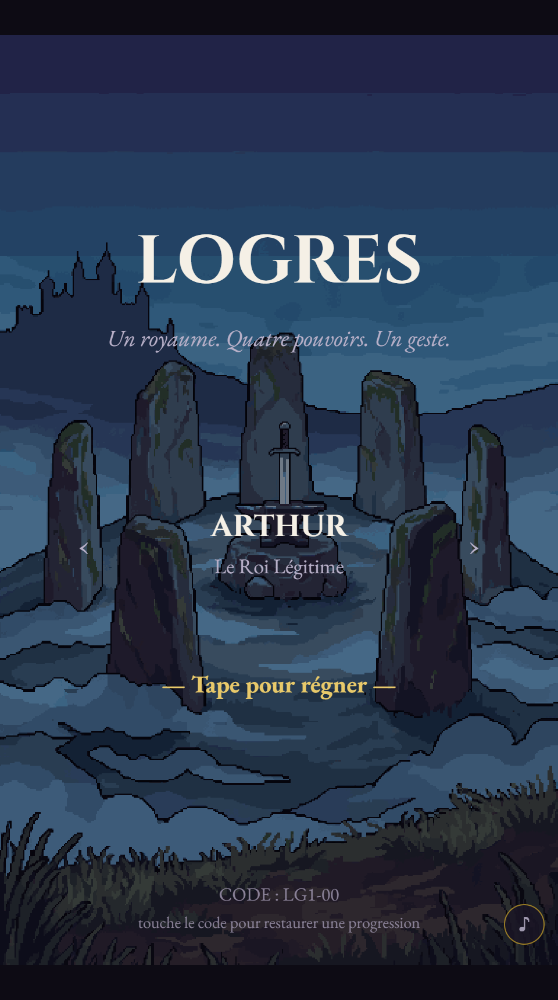
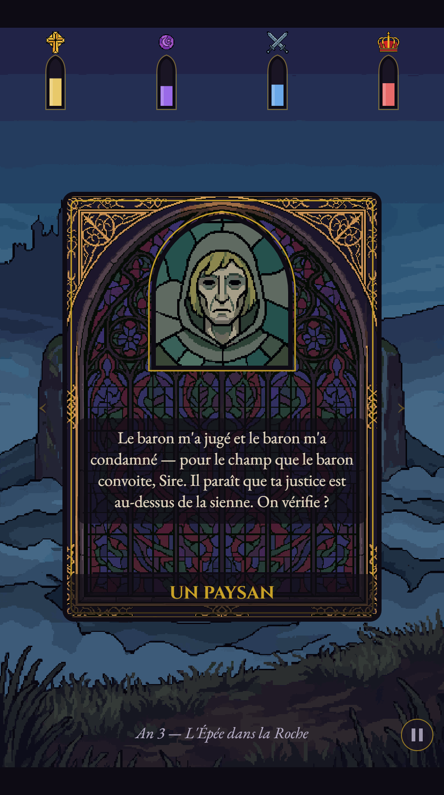
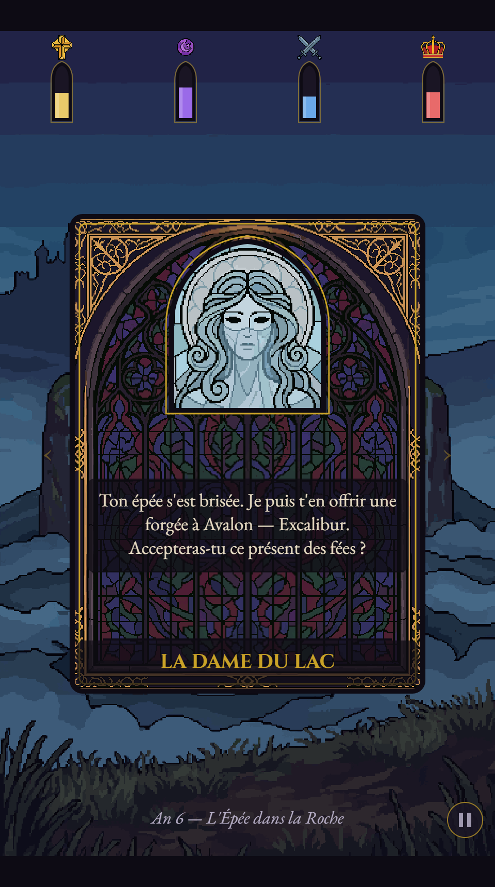

# Logres

<p align="center">
  <a href="https://zolkiev.github.io/Slop/logres/"><b>▶️&nbsp;JOUER DANS LE NAVIGATEUR</b></a>
</p>

Un **Reigns-like arthurien**. Tu es le roi de Logres : chaque carte est un dilemme,
chaque geste — swipe à **gauche** ou à **droite** — pousse quatre pouvoirs. Il n'y a
pas de victoire : tu **survives**, aussi longtemps que tu tiens l'équilibre entre
l'Église, la magie, la chevalerie et la couronne. Un règne est une version de la
légende ; ta mort, toujours, en dit la chute.

<p align="center">
  
  
  
</p>

## Comment jouer

- **Une seule action** : tape/clique/glisse un côté de la carte, ou les flèches
  **←/→** au clavier. C'est tout — pas d'autre bouton, jamais. C'est l'ADN Slop.
- **Avant de valider**, amorce le geste : les jauges qui vont bouger s'illuminent.
- Chaque carte jouée = **+1 an** de règne. Survis assez longtemps et tu traverses
  toute la légende, ère après ère.

### Les 4 pouvoirs (et comment on meurt)

Quatre jauges de 0 à 100, départ à 50. Un choix en bouge une à trois. Tu meurs dès
qu'une touche **le fond ou le plafond** — et la mort est **toujours thématique** :

| Pouvoir | À **0** | À **100** |
|---|---|---|
| **Foi** ✝️ | Excommunié, tu meurs seul | L'Inquisition te brûle |
| **Magie** 🔮 | La magie s'éteint, Merlin t'abandonne | Les fées d'Avalon t'emportent |
| **Chevalerie** ⚔️ | La Table se disperse, les Saxons déferlent | Un champion adulé t'usurpe |
| **Couronne** 👑 | Les barons se soulèvent | Tyran, le peuple te renverse |

L'axe **Foi ⚔ Magie** est le cœur du jeu : monter l'un fait souvent plonger l'autre.
Rester en vie, c'est **jongler** — ne jamais laisser une jauge filer vers un bord.

### Des quêtes qui émergent

Il n'y a pas de « missions ». Les grands arcs de la légende — Mordred de sa
conception à Camlann, Excalibur et son Fourreau, le Graal, la reine et Lancelot —
sont des **fils narratifs** qui se tissent selon les portes que tu ouvres. Un choix
posé à l'ère de la Roche ressort **des années plus tard**, entre deux autres cartes,
quand tu ne t'y attends plus. « Réussir » une quête n'est jamais le but : c'est un
levier (ou un piège) pour tenir tes jauges sur le long terme.

Certaines cartes basculent même en **duel** — une Épreuve d'armes qui reste un
simple swipe, mais où tes choix passés décident si tu encaisses ou si tu tombes.

### Les 5 ères

Le règne avance avec l'âge, pas avec tes choix : **la Roche** → **Camelot** →
**le Graal** → **la Chute** → **Avalon**. Chacune a son décor, sa musique et son
paquet de dilemmes. Survivre longtemps, c'est traverser toute la matière de Bretagne.

### Progression & sauvegarde

À ta mort, la lignée peut continuer : ton **record d'années** débloque des **rois de
départ** aux pouvoirs déséquilibrés (Uther le Conquérant, Constantin le Pieux,
Morgane la Reine-Fée). Tout est sauvegardé dans le navigateur, plus un **code rétro**
`LG1-XXX` (ou lien `…#save=LG1-XXX`) qui restaure ta progression sur n'importe quel
appareil — aucun compte, aucun backend.

## Développer

100 % vanilla JS + Canvas 2D, zéro dépendance runtime. Build via [Vite](https://vitejs.dev).

```bash
cd 2nd_Slop
npm install
npm run dev      # serveur local (http://localhost:5173)
npm test         # tests Vitest
npm run build    # build de production dans dist/
```

Les assets (portraits vitrail, décors, musique) sont générés via
[PixelLab](https://pixellab.ai) et chargés au runtime depuis `assets/`.

- **Mécanique de fond** : `docs/GAMEPLAY.md` (la boucle, les jauges, les quêtes
  émergentes, les reliques, le méta).
- **Vision & ton** : `docs/DESIGN.md`.
