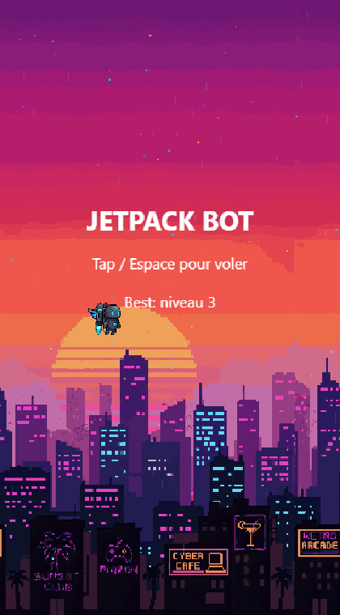
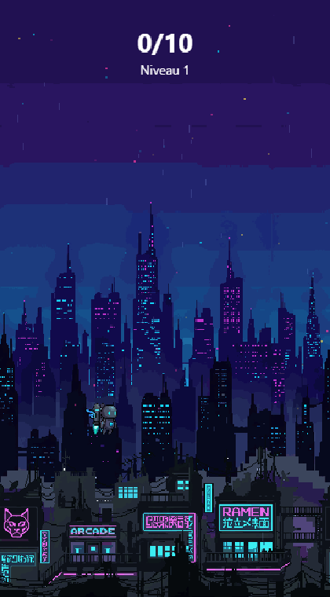
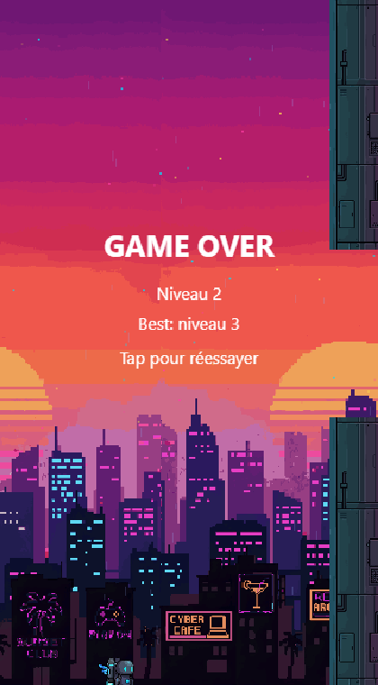

# Slop Games

Collection de petits jeux web/mobile simples mais addictifs (« slop games »).
Chaque jeu est autonome : son propre code, ses assets (générés via [PixelLab](https://pixellab.ai)) et son déploiement.

## Structure

```
Slop/
├── _starter-template/   # Squelette réutilisable (à venir)
├── 1st_Slop/            # Jeu 1 — Jetpack Bot
└── ...                  # Un dossier par jeu
```

---

## 🤖 1er jeu — Jetpack Bot

Un Flappy-like vertical sur le thème d'un robot à jetpack dans une mégapole cyberpunk.
Tape pour activer la poussée, slalome entre les gratte-ciels néon, et enchaîne les niveaux
de plus en plus rapides.

<p align="center">
  
  
  
</p>

- **Niveaux infinis** qui montent en difficulté (vitesse ↗, ouvertures ↘).
- Fin de niveau en passant 10 portes ; crash → on rejoue le niveau en cours.
- Score = **niveau max atteint**, sauvegardé en local.
- 100 % vanilla JS + Canvas 2D, zéro dépendance runtime.

▶️ **Pour jouer / développer**, voir [`1st_Slop/README.md`](1st_Slop/README.md).

```bash
cd 1st_Slop
npm install
npm run dev      # serveur local
```
